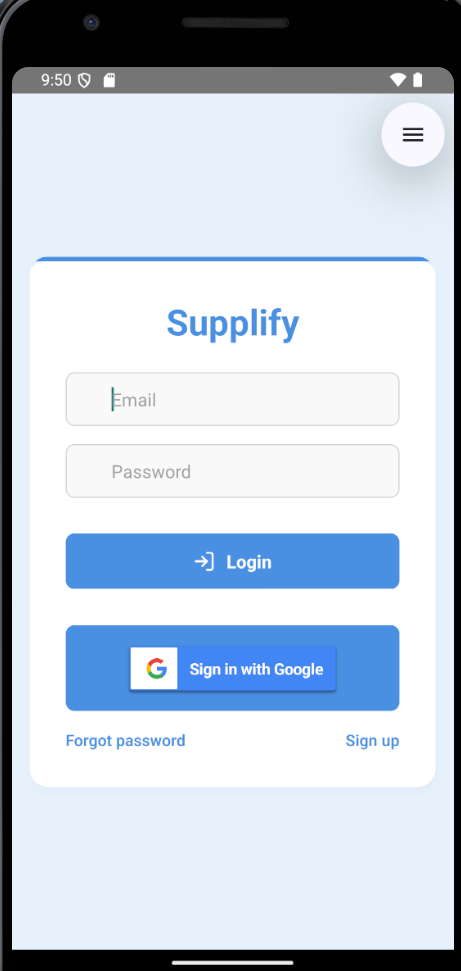
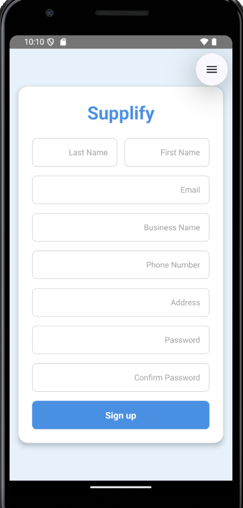
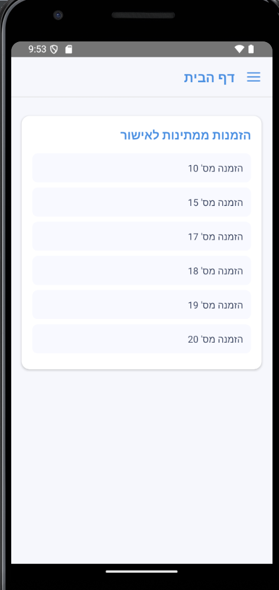
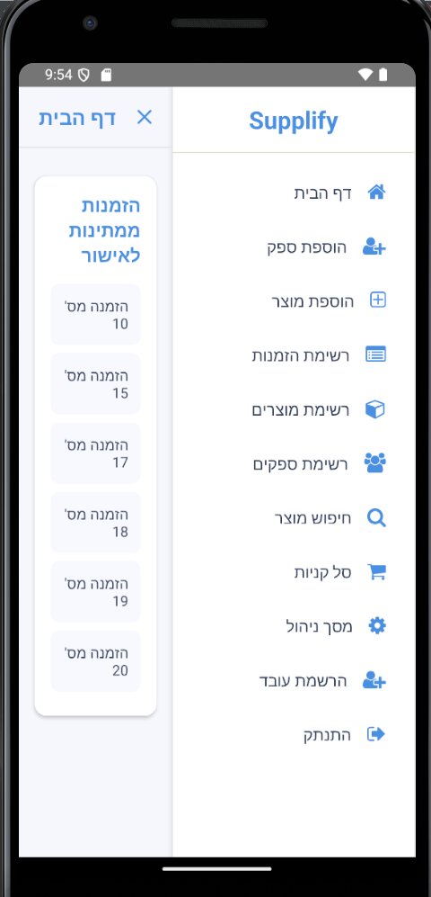
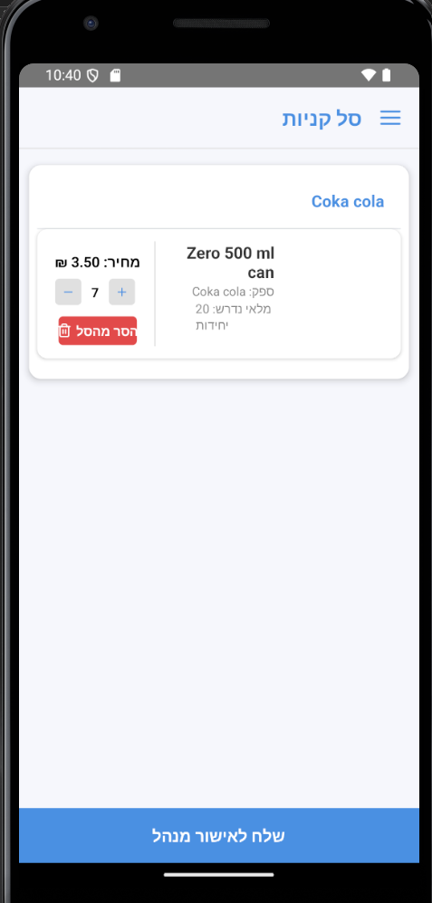
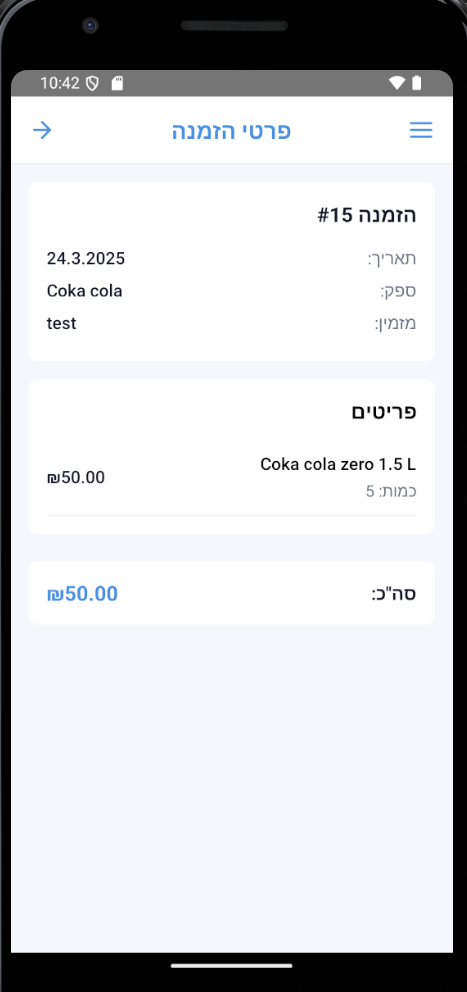
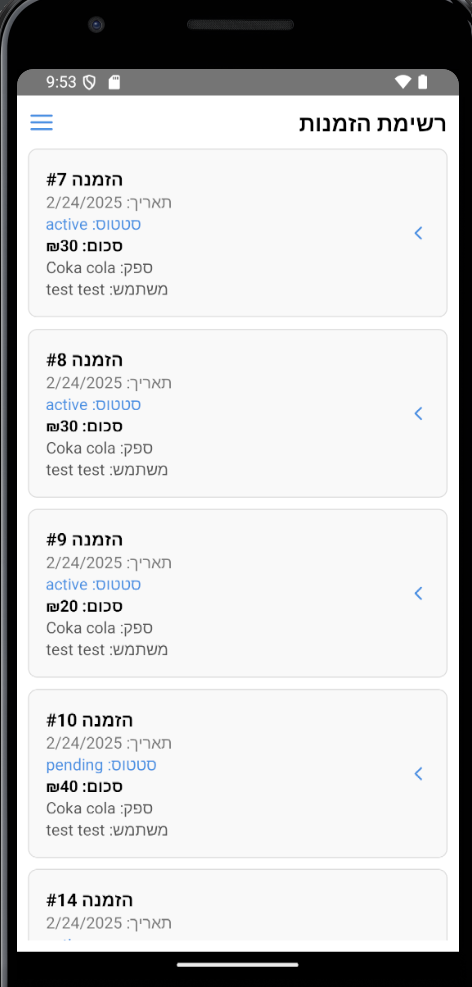
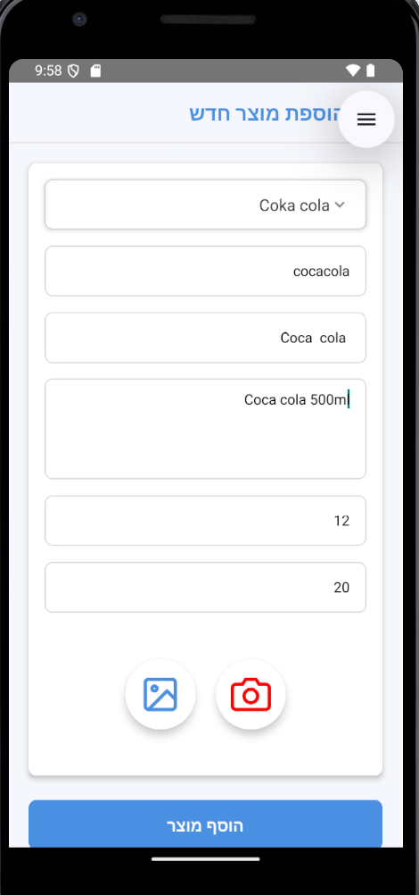

# Supplify

## Overview

Our project aims to develop a mobile application that simplifies the product ordering process for small businesses.

Currently, small businesses must manually create and send separate order lists to multiple suppliers via WhatsApp, which is time-consuming and prone to errors.

### Programming Languages & Frameworks

Backend: Java + Spring Boot
Frontend: React Native

### Database

MySQL

### Notification System

Firebase

WhatsApp API Communication: Twilio

## System Architecture Overview

Supplify follows a robust Client-Server architecture, consisting of three primary components:

### Frontend (Client):

Built with React Native for cross-platform mobile compatibility

Handles user interactions, form validations, and state management

Communicates with backend services through RESTful API calls

Manages local storage for offline capabilities and improved performance

### Backend (Server):

Powered by Spring Boot with Java

Implements business logic, security controls, and data validation

Manages authentication and authorization using JWT tokens

Processes incoming API requests and orchestrates database operations

Handles integration with third-party services

### Communication & Notification Layer:

Firebase: Manages push notifications and real-time updates

WhatsApp Business API (Twilio): Facilitates direct communication with suppliers

Enables automated order confirmations and status updates

The system employs a RESTful API architecture, allowing seamless communication between components while maintaining separation of concerns. This modular design ensures scalability and facilitates future enhancements.

## Features

**Supplier Management:** Easily add, remove, and update supplier details.

**Order Consolidation:** Automatically combine orders from different suppliers into a unified order list.

**Automated Communication:** Send orders directly to suppliers via WhatsApp Business API (Twilio).

**User Roles:** Separate views and functionalities for employees and managers

## Backend Code Structure

supplify-backend/
├── src/main/java/com/supplify/

│   ├── entities/         # JPA Entities (e.g., Agent, Supplier, Order)

│   ├── repositories/     # Database access layer (Spring Data JPA)

│   ├── services/         # Business logic layer

│   ├── controllers/      # REST API endpoints

│   ├── dto/              # Data Transfer Objects

│   ├── config/           # Configuration files

│   ├── utils/            # Utility classes

└── src/main/resources/

    ├── application.yml   # Spring Boot configuration

### Installation

#### Backend Setup

1.Clone the repository.

2.Install dependencies:

3.Run the application.

#### Frontend Setup

1.navigate to the frontend directory:

cd ../frontend

2.Install dependencies:

npm install

3.Run the React Native app:

npx react-native run-android

## 📸 Visual
To make this documentation more user-friendly, we’ve included screenshots of the key features of Supplify. These images provide a clear understanding of how the app works, making it easier for new users to navigate and use the system efficiently.

### 1️⃣ Login & Registration

 
  

### 2️⃣ Home Page & SideBar

 
  

### 3️⃣ Orders

 
  

 

### 4️⃣ Add Product & Business

 
  

